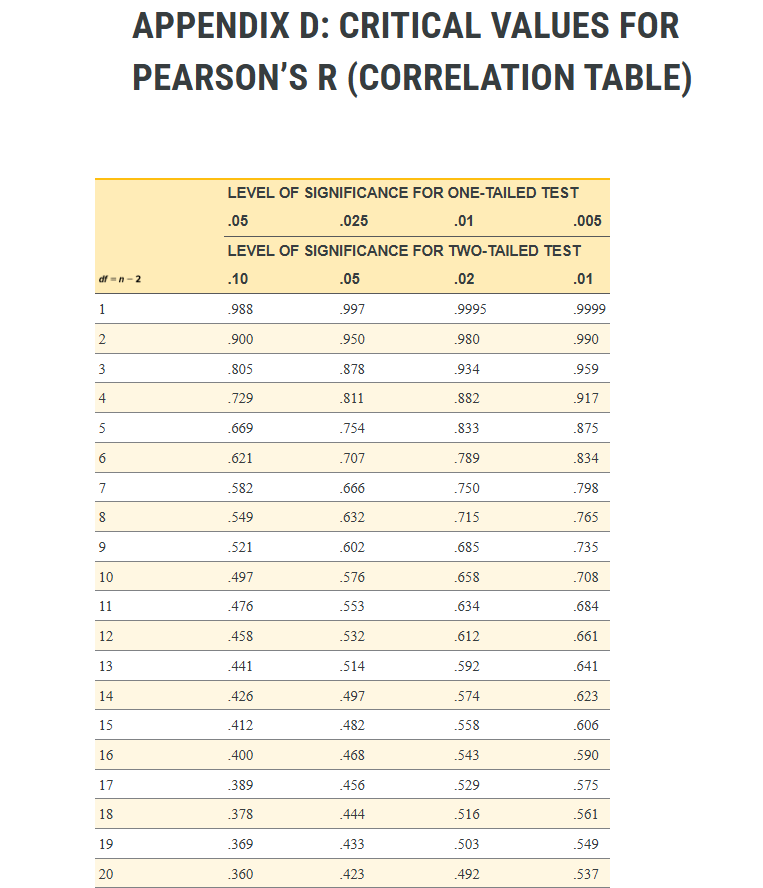

<style type="text/css">
body, td { /* Normal text and table data */
  font-size: 16px;
  line-height: 1.5; /* Controls line spacing */
}
h1, h2, h3, h4, h5, h6 { /* Headings */
  line-height: 1.2;
}
pre { /* Code blocks - determines line spacing between lines */
  font-size: 14px;
  line-height: 1.4; 
}
code.r { /* Inline R code */
  font-size: 14px;
}
</style>

```{r setup, include=FALSE}
knitr::opts_chunk$set(echo = TRUE)
```


```{r packages, echo=FALSE, warning=FALSE, message=FALSE}

library(tidyverse)
library(SuppDists)
library(paletteer)

```

In short, an *r*-distribution is a sampling distribution of *r*-values under the null hypothesis. If this sounds a bit like gibberish, then you clearly didn't look at my "So, Like, What Is a T-Distribution, Anyway?" page. Or, worse yet, you *did* look at that page and it *still* sounds like gibberish. Well, regardless, let's try to carry on. We'll start by defining sampling distributions, then discuss Pearson's correlations as inferential tests, and then wrap up by creating (simulating) our own sampling distributions - this time plotting our results with slightly more tropical colors! Neat, eh?  

## Background

### Sampling distributions

An *r*-distribution is just like a *t*-distribution, an *F*-distribution, or a $\chi^2$-distribution, in that it is a **sampling distribution** of a test statistic. Recall that a sampling distribution is a theoretical probability distribution that is created by taking a sample of size *n* from a larger population, extracting a sample statistic (in this case, the correlation coefficient of *r*), recording this value, and then repeating this process an infinite number of times. Just like other sampling distributions associated with statistical tests, the shape of the r-distribution depends on the *degrees of freedom* (df) which, in the case of the Pearson's correlation coefficient, is the sample size (*n*) minus two. 

Why does the sampling distribution's shape change based on the degrees of freedom? Recall that the standard deviation of a sampling distribution (i.e., the standard error) depends on the sample size. So, if we are creating a sampling distribution with, say, 10 observations (df = 8), the width of this distribution is going to be larger than if we are creating a sampling distribution with, say, 1000 observations (df = 998).

### Hypothesis testing and Pearson's Correlations

When we perform an inferential test (including a Pearson's correlation), we are particularly interested in testing a **null hypothesis** (the hypothesis of no change) against an **alternative hypothesis**. With Pearson's correlation tests, we are specifically interested in testing whether there is a linear relationship between two continuous variables. Pearson's *r* values can range from -1 (perfect negative linear association) to +1 (perfect positive linear association), as visualized via scatterplots below:

```{r plotcorrs, echo=FALSE}


# Generate data for different correlation strengths
n <- 100 # Number of data points

# Perfect positive correlation (r = 1)
x1 <- rnorm(n)
y1 <- x1 + rnorm(n, sd = 0.1) # Add small noise for visual clarity

# Strong positive correlation (r = 0.8)
x2 <- rnorm(n)
y2 <- 0.8 * x2 + sqrt(1 - 0.8^2) * rnorm(n)

# Strong positive correlation (r = 0.6)
x3 <- rnorm(n)
y3 <- 0.6 * x3 + sqrt(1 - 0.6^2) * rnorm(n)

# Strong positive correlation (r = 0.4)
x4 <- rnorm(n)
y4 <- 0.4 * x4 + sqrt(1 - 0.4^2) * rnorm(n)

# Strong positive correlation (r = 0.2)
x5 <- rnorm(n)
y5 <- 0.2 * x5 + sqrt(1 - 0.2^2) * rnorm(n)

# No correlation (r = 0)
x6 <- rnorm(n)
y6 <- rnorm(n)

# Strong negative correlation (e.g., r = -0.2)
x7 <- rnorm(n)
y7 <- -0.2 * x7 + sqrt(1 - (-0.2)^2) * rnorm(n)

# Strong negative correlation (e.g., r = -0.8)
x8 <- rnorm(n)
y8 <- -0.4 * x8 + sqrt(1 - (-0.4)^2) * rnorm(n)

# Strong negative correlation (e.g., r = -0.6)
x9 <- rnorm(n)
y9 <- -0.6 * x9 + sqrt(1 - (-0.6)^2) * rnorm(n)

# Strong negative correlation (e.g., r = -0.8)
x10 <- rnorm(n)
y10 <- -0.8 * x10 + sqrt(1 - (-0.8)^2) * rnorm(n)

# Perfect negative correlation (r = -1)
x11 <- rnorm(n)
y11 <- -x11 + rnorm(n, sd = 0.1)

sample.cors <- data.frame(x=c(x1,x2,x3,x4,x5,x6,x7,x8,x9,x10,x11), y=c(y1,y2,y3,y4,y5,y6,y7,y8,y9,y10,y11),r=c(rep(1, 100), rep(0.80, 100), rep(0.60, 100), rep(0.40, 100), rep(0.20, 100), rep(0, 100), rep(-0.20, 100), rep(-0.40, 100), rep(-0.60, 100), rep(-0.80, 100), rep(-1, 100)))

sample.cors$rf <- as.factor(sample.cors$r)

ggplot(sample.cors, aes(x=x,y=y,fill=rf))+
  facet_wrap(~r, labeller = label_both, ncol=4)+
  geom_point(alpha=0.6, color="black", pch=21)+
  scale_fill_paletteer_d("MoMAColors::Klein")+
  theme_classic()+
  theme(legend.position="none")

```
<br>I bet you never tire of seeing scatterplots depicting different correlation strengths, do you? YOU DO?! Oh. Well, at least these ones have some interesting colors, right? *Not tropical enough, you say??* Okay, noted. I will do better next time.

Let's go beyond the inspired variable names of "x" and "y" used in the above scatterplot and ground our discussion of correlation in something more interesting. Imagine that we have two continuous variables - (1) number of times one visited Tim Hortons in the past year, and (2) number of times one apologized for something that was not one's fault in the past year. (Sorry for poking some light fun at Canadian stereotypes.) In this scenario, the null hypothesis would state that there is no linear association between these variables - i.e., as the number of "Tim's runs" increases or decreases, there is no systematic increase or decrease in "Sorries". An alternative hypothesis would state that there **is** a linear association between these variables - i.e., as the number of "Tim's runs" increases, the number of "Sorries" systematically increases **or** decreases. This would specifically be called a *non-directional* (two-tailed) test, as we are interested in assessing whether there is a positive or a negative correlation. 


### The r-distribution

Before we get into the fancy simulation stuff, let's first visualize those canonical *r*-distributions, that are often included in those back-of-the-statistics-textbook appendices:

```{r plot_r, echo=FALSE}

tropical_manual <- c("#ff00ab", "#ffea00", "#da70d6", "#76b947")

# Set degrees of freedom
df.1 <- 5
df.2 <- 10
df.3 <- 50
df.4 <- 100

#############################
# Define range of r values #
#############################
r_values <- seq(-1, 1, length.out = 100)

# Calculate densities
densities.1 <- dPearson(r_values, N = 7, rho = 0)
densities.2 <- dPearson(r_values, N = 12, rho = 0)
densities.3 <- dPearson(r_values, N = 52, rho = 0)
densities.4 <- dPearson(r_values, N = 102, rho = 0)

r.dist.df <- data.frame("df"=c(rep(df.1, 100), rep(df.2, 100), rep(df.3, 100), rep(df.4, 100)), r=c(r_values, r_values, r_values, r_values), p=c(densities.1, densities.2, densities.3, densities.4))

r.dist.df$df <- as.factor(r.dist.df$df)
r.dist.df$p <- (r.dist.df$p) / 10

ggplot(r.dist.df, aes(x=r, y=p, group=df, color=df)) +
  geom_line(lwd=1) +
  labs(x="r", y="p(x)")+
  coord_cartesian(xlim=c(-1,1))+
  scale_color_manual(values=tropical_manual)+
  theme_classic()


```
<br>First, I would like the record to show that I made good on my promise to use tropical colors. Second, as you can see, the *r*-distribution with relatively few degrees of freedom (df = 5) also has the heaviest tails. Practically speaking, this means that a more extreme *r*-value would be needed to reject the null hypothesis. 

For example, let's say you considered a "statistically significant" finding to be one that would occur less than 5% of the time if the null hypothesis is true - i.e., you set your significance level (alpha, or $\alpha$) to .05. If we cared about both sides of the distribution, we'd have to look for the point on the *r*-distribution that corresponds to the 2.5th percentile and the 97.5th percentile (as values more extreme than this would constitute the 5% of the values that are in the tail of the distribution). If you had five degrees of freedom (e.g., you had observations of "Tim's runs" and "Sorries" from *n*=7 participants in your sample), you would need an *r*-value less than -.75 or greater than .75 to reject the null hypothesis! In contrast, if you had a sample of 102 participants (df = 100), you would only need a *r*-value of less than -.195 or greater than .195 to reject the null hypothesis. 

This hopefully makes intuitive sense, because a smaller sample size (corresponding to fewer degrees of freedom) leads to a more variable estimate - hence the wider distribution, and a more extreme *r*-value needed to reject the null hypothesis!

## An Example

It's one thing to use an *r*-distribution table in some textbook appendix, but let's make that back-of-the-book table a bit more concrete. Remember that a *r*-distribution is a **sampling distribution of r-statistics, generated under a null hypothesis**. So, to create our very own *r*-distribution, we need to determine our sample size (as this is directly related to degrees of freedom, which influences the shape of the *r*-distribution) and we need to simulate a dataset in which the null hypothesis is true.

### Generate a Population Distribution

Let's create two population distributions (*N* = 75,000 each) that are normally distributed. The first will serve as our "Tim's Runs" distribution (i.e., number of times one went to Tim Hortons in the past year), and the other will serve as our "Sorries" distribution (i.e., the number of times one apologized unnecessarily in the past year). I'll use my own personal experience to ground these values, so the "Tim's Runs" distribution will have a mean of 20 (*SD* = 5) and the "Sorries" distribution will have a mean of 200 (*SD* = 40):


```{r generate_pop_dists, message=FALSE}

#Set seed for reproducibility 
set.seed(1964) #Year the first Tim Hortons opened, because why not. 

#Generate normal distributions for Tim's Runs and Apologies
tim.data <- rnorm(n = 75000, mean=20, sd = 5)
apology.data <- rnorm(n = 75000, mean=200, sd = 40)

combined.data <- data.frame("Tims" = tim.data, "Apologies" = apology.data)

ggplot(combined.data, aes(x=Tims)) +
  geom_histogram(fill="cyan2", color="black", alpha=0.6)+
  labs(x = "Tim Hortons Visits", y = "Count") +
  theme_classic()

ggplot(combined.data, aes(x=Apologies)) +
  geom_histogram(fill="green", color="black", alpha=0.6)+
  labs(x = "Sorries", y = "Count") +
  theme_classic()

ggplot(combined.data, aes(x=Tims, y=Apologies)) +
  geom_point(color="magenta3", alpha=0.1)+
  labs(x = "Tim Hortons Visits", y = "Sorries") +
  theme_classic()

```

```{r print_descriptives, echo=FALSE}

#Descriptive Statistics for the Population
cat("The population mean for Tim Hortons Visits is", round(mean(combined.data$Tims), 2))

cat("The population standard deviation for Tim Hortons Visits is", round(sd(combined.data$Tims), 2))

cat("The population mean for Sorries is", round(mean(combined.data$Apologies), 2))

cat("The population standard deviation for Sorries is", round(sd(combined.data$Apologies), 2))

cat("The Pearson's correlation between Tim Hortons Visits and Sorries is", round(cor(combined.data$Tims, combined.data$Apologies), 2))

```

What do we see, apart from those objectively lovely colors that evoke rainbow sherbet smoothies on a tropical beach? Well, we see largely what we expect. The two distributions have the population parameters we specified (plus or minus a few hundredths). Additionally, the scatterplot and the corresponding Pearson's correlation, for lack of a better description, are just a mess. **This is expected!** After all, *we randomly generated these sets of numbers*. There's nothing special that links the "Tim's Run" values from a given row to the "Unnecessary Apologies" values from a given row. Thus, it is expected that the Pearson's correlation coefficient would be effectively zero. Thus, we now have a population distribution in which the null hypothesis is true (i.e., the Pearson's correlation coefficient is zero).

Now we can get to the fun stuff. Let's pretend that we collected a sample of participants from this larger population. We are interested in testing whether the correlation coefficient differs from zero. The hypothesis pair is thus:

$H_0: \rho = .00$<br>
$H_1: \rho \neq .00$

Note: Unlike *t*-tests and ANOVAs, we are using "rho" ($\rho$) in our hypothesis pair, as this is the Greek symbol to represent the population parameter. Also, in case you missed it, we *know* that the null hypothesis is true for this dataset! **The correlation coefficient is zero, as shown above.** So, the question becomes: if we create a sampling distribution of *r*-values when the null hypothesis is true (as it is here), what does it look like?

Although you might be tempted to say "we'll always see a correlation of zero in our samples" because the correlation at the population level is zero, remember the concept of **sampling error**. When we take a smaller sample of a larger population, the values we see will not be exactly the same every time. So, when we run correlations on our samples, we'll expect values close to zero most of the time, but sometimes the correlations in our samples will deviate from zero due to sampling error alone. The extent to which these samples deviate from zero will depend on the amount of sampling error that is present. All else being equal, sampling error *decreases* as sample size *increases*. Also, as it turns out, comparing a calculated test statistic (whether that's *r*, *t*, *F*, $\chi^2$ etc.) against what would be expected due to sampling error alone is kind of the whole vibe of null hypothesis significance testing.


## Generate r-distributions

Remember that a *r*-distribution is a sampling distribution of *r*-values under the null hypothesis, but the shape of that distribution depends on the degrees of freedom (see the first tropical graph if you don't believe me) This is because there is a greater amount of *sampling error* for distributions with fewer degrees of freedom. So, what we are going to do now is create four different sampling distributions (df = 5, df = 10, df = 50, df = 100) and we are going to compare these to that first graph in terms of their shape.

We obviously cannot create true sampling distributions, as we will not be repeating the sampling process an infinite number of times. However, we'll plan to create a sampling distribution with a "TimBit&trade;load" of values (100,000, to be precise). This should give us a pretty good sense of the size and shape of the sampling distribution, and allow us to compare this generated sampling distribution to the "actual" *r*-distributions that you might find at the back of a textbook.

To be clear (to the point of being redundant), what we are doing is:

1. Randomly sampling from the larger population distribution (e.g., 12 values for the df=10 distribution)
2. Calculating the Pearson's correlation coefficient for those randomly selected 12 values
3. Saving that r-value
4. Repeating that process 100,000 times
5. Plotting the distribution of those sampled r-values

So, let's do it, already!

```{r rdists}

rs.indsample.df5 <- c() #for storing r-values (df=5)
rs.indsample.df10 <- c() #for storing r-values (df=10)
rs.indsample.df50 <- c() #for storing r-values (df=50)
rs.indsample.df100 <- c() #for storing r-values (df=100)


#Generate sampling distribution for Pearson's correlation coefficient (df=5)
for(i in 1:100000){
  sampled_rows <- sample(1:nrow(combined.data), 7, replace = FALSE) # n=7, df=5
  s1 <- combined.data[sampled_rows, ]
  rs.indsample.df5[i] <- cor(s1$Tims, s1$Apologies)
}

#Generate sampling distribution for Pearson's correlation coefficient (df=10)
for(i in 1:100000){
  sampled_rows <- sample(1:nrow(combined.data), 12, replace = FALSE) # n=12, df=10
  s1 <- combined.data[sampled_rows, ]
  rs.indsample.df10[i] <- cor(s1$Tims, s1$Apologies)
}

#Generate sampling distribution for Pearson's correlation coefficient (df=50)
for(i in 1:100000){
  sampled_rows <- sample(1:nrow(combined.data), 52, replace = FALSE) # n=52, df=50
  s1 <- combined.data[sampled_rows, ]
  rs.indsample.df50[i] <- cor(s1$Tims, s1$Apologies)
}

#Generate sampling distribution for Pearson's correlation coefficient (df=100)
for(i in 1:100000){
  sampled_rows <- sample(1:nrow(combined.data), 102, replace = FALSE) # n=102, df=100
  s1 <- combined.data[sampled_rows, ]
  rs.indsample.df100[i] <- cor(s1$Tims, s1$Apologies)
}


r.dist.df.add <- data.frame("df" = c(rep(5, 100000), rep(10, 100000), rep(50, 100000), rep(100, 100000)), r=c(rs.indsample.df5, rs.indsample.df10, rs.indsample.df50, rs.indsample.df100))

r.dist.df.add$df <- as.factor(r.dist.df.add$df)


ggplot(r.dist.df.add, aes(x=r, color=df, group=df))+
  geom_freqpoly(binwidth=0.03, position="identity", lwd=0.75)+
  labs(title="Simulated R-Distributions for Different Degrees of Freedom", x="r-value", y="Count") +
  theme_classic()+
  scale_color_manual(values=tropical_manual)+
  theme(legend.position="bottom")


```

Pretty cool, eh? Plus, those colors are still holding up, if I may so so myself.

The simulated *r*-distributions certainly seem to look similar to the "actual" r-distributions we plotted earlier, but this does not necessary mean that the distributions we have created are the same as those you might find in a textbook appendix.

One way we can check this is to see what *r*-values in our simulated distributions correspond to common significance levels ($\alpha$). *R*-tables provide common values researchers might want to use as their significance level, for both one- and two-tailed tests. For example, let's look at this snapshot of the *r*-table from the Open Access Textbook "Introduction to Statistics in the Psychological Sciences" (Cote et al., 2021):


<br>

If we find the row corresponding to df = 5, for example, we can see *r*-values that correspond to several significance levels (and consequently, percentiles). The first column would correspond to both the 5th and 95th percentiles (as 10% of the distribution falls outside of this range of -.669 to .669, in the tails of the distribution), the second column represents the 2.5th and 97.5th percentiles (as 5% of the distribution falls outside of this range of -.754 and .754, in the tails of the distribution), and so on. What this means is that we can compare our simulated *r*-distributions to these established "critical" values.

To do this, we'll find the *r*-values corresponding to the relevant percentiles from our simulated distributions, and then plot them against the "real" *r*-distribution values.


```{r rlookup}


#For the actual values, we'll just use the exact values in the look-up table
r.actual.df5 <- c(0.669, 0.754, 0.833, 0.875)
r.actual.df10 <- c(0.497, 0.576, 0.658, 0.708)
r.actual.df50 <- c(0.231, 0.273, 0.322, 0.354)
r.actual.df100 <- c(0.164, 0.195, 0.230, 0.254)

#For our simulated t-distribution, we'll take the absolute mean of the two values corresponding to the thresholds. Although the two values should be nearly identical, this will increase robustness of the values.
#df = 5
r.observed.df5 <- c(mean(abs(quantile(rs.indsample.df5, c(0.05, 0.95)))), mean(abs(quantile(rs.indsample.df5, c(0.025, 0.975)))), mean(abs(quantile(rs.indsample.df5, c(0.01, 0.99)))), mean(abs(quantile(rs.indsample.df5, c(0.005, 0.995)))))

#df = 10
r.observed.df10 <- c(mean(abs(quantile(rs.indsample.df10, c(0.05, 0.95)))), mean(abs(quantile(rs.indsample.df10, c(0.025, 0.975)))), mean(abs(quantile(rs.indsample.df10, c(0.01, 0.99)))), mean(abs(quantile(rs.indsample.df10, c(0.005, 0.995)))))

#df = 50
r.observed.df50 <- c(mean(abs(quantile(rs.indsample.df50, c(0.05, 0.95)))), mean(abs(quantile(rs.indsample.df50, c(0.025, 0.975)))), mean(abs(quantile(rs.indsample.df50, c(0.01, 0.99)))), mean(abs(quantile(rs.indsample.df50, c(0.005, 0.995)))))

#df = 100
r.observed.df100 <- c(mean(abs(quantile(rs.indsample.df100, c(0.05, 0.95)))), mean(abs(quantile(rs.indsample.df100, c(0.025, 0.975)))), mean(abs(quantile(rs.indsample.df100, c(0.01, 0.99)))), mean(abs(quantile(rs.indsample.df100, c(0.005, 0.995)))))

df.crit.add <- data.frame(df=c(rep("5", 4), rep("10", 4), rep("50", 4), rep("100", 4)), Observed = c(r.observed.df5, r.observed.df10, r.observed.df50, r.observed.df100), Actual = c(r.actual.df5, r.actual.df10, r.actual.df50, r.actual.df100), Alpha=rep(c(.10, .05, .02, .01), 4))

df.crit.add$Alpha <- factor(df.crit.add$Alpha, levels=c("0.1", "0.05", "0.02", "0.01")) #Make alpha a factor for plotting

df.crit.add$df <- factor(df.crit.add$df, levels=c("5", "10", "50", "100")) #Make df a factor for plotting

ggplot(df.crit.add, aes(x=Observed, y=Actual, fill=Alpha, group=df)) +
  facet_wrap(~df, scales="free", labeller = label_both)+
  geom_abline(intercept = 0, slope = 1, lty=2)+
  geom_point(size=3, color="black", pch=21) +
  labs(x="Observed (Simulated) r", y="Actual r", fill = expression(paste("Sig. Level (", alpha, ")")))+
  scale_fill_manual(values=tropical_manual)+
  theme_classic()


#Print correlation values
 df_correlations <- df.crit.add %>%
      group_by(df) %>%
      summarize(correlation = cor(Observed, Actual))

 df_correlations
 

```

**Sweet dutchie with a walnut crunch!** We see that each of our simulated *r*-distributions essentially perfectly correlates with the actual values one would obtain via a *r*-table, and shows a nearly perfect one-to-one correspondence (as they fall on the dashed line). Yes, I realize that using correlations to assess the linear association of simulated versus actual r-table critical values is pretty meta. We will print the actual versus observed values below to demonstrate this (essentially perfect) relationship between the observed and actual critical values more clearly:

#### Comparison of values for df = 5

```{r compvalues01}

df.crit.add %>%
      filter(df == 5) 

```

#### Comparison of values for df = 10

```{r compvalues02}

df.crit.add %>%
      filter(df == 10) 

```

#### Comparison of values for df = 50

```{r compvalues03}

df.crit.add %>%
      filter(df == 50) 

```


#### Comparison of values for df = 100

```{r compvalues04}

df.crit.add %>%
      filter(df == 100) 

```
## Conclusion

If you have made it this far, congratulations! You officially need new hobbies. **I KID!** After all, I'm the guy who spent a few hours putting this together. Although this might be more than you ever wanted (or needed) to know about *r*-distributions, it is my hope that this provides just a bit more context for what those somewhat abstract *r*-tables at the back of textbooks represent. Now when your statistics instructor, your produce supplier, or your frenemy-slash-crush tells you that a *r-distribution is a sampling distribution of r-values under a null hypothesis*, you'll hopefully be able to strike up a rich conversation about sampling distributions, inferential statistics, degrees of freedom, and more!


<br>