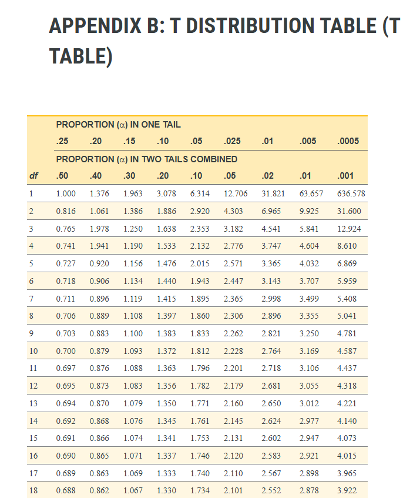

<style type="text/css">
body, td { /* Normal text and table data */
  font-size: 16px;
  line-height: 1.5; /* Controls line spacing */
}
h1, h2, h3, h4, h5, h6 { /* Headings */
  line-height: 1.2;
}
pre { /* Code blocks - determines line spacing between lines */
  font-size: 14px;
  line-height: 1.4; 
}
code.r { /* Inline R code */
  font-size: 14px;
}
</style>

```{r setup, include=FALSE}
knitr::opts_chunk$set(echo = TRUE)
```


```{r packages, echo=FALSE, warning=FALSE, message=FALSE}

library(tidyverse)

```

In short, a *t*-distribution is a sampling distribution of *t*-values under the null hypothesis. If this sounds a bit like gibberish, read on! You'll learn more about the key concepts that relate to *t*-distributions. We'll even wrap up by creating our own *t*-distributions using a made-up dataset, and plotting our results in moderately attractive colors.

## Background

### Sampling distributions

A *t*-distribution is a sampling distribution. But what is a sampling distribution, exactly? A sampling distribution is a theoretical probability distribution that is created by taking a sample of size *n* from a larger population, extracting a sample statistic (e.g., mean), recording this value, and then repeating this process an infinite number of times. Although the sampling distribution of the mean is likely the first kind of sampling distribution that comes to mind, we can create a sampling distribution from *any* extracted statistic - even *t*-values! So, the idea here is that for a given sample size (e.g., *n* = 10), we would randomly sample 10 values from the larger population, perform a *t*-test, record the *t*-value, and then repeat this process an infinite number of times (new sample of 10, new calculated *t*-value, etc.).

### Inferential statistics and hypothesis testing

*T*-tests (and the *t*-distributions on which they rely) are one type of inferential statistical test. Inferential statistics involves making *inferences* about a larger population from a smaller *sample* or *samples* of data. The specific kind of inferential test we use depends on many factors, including the number of samples we have collected (one? two? ten?), the levels of measurement (are the values continuous? nominal?).

When we perform an inferential test, we are particularly interested in testing a **null hypothesis** (the hypothesis of no change) against an **alternative hypothesis**. For example, if we collected IQ scores from two samples (cat lovers versus cat haters), we might want to know if the samples come from the *same* population or *different* populations. The null hypothesis states that there is no difference between the samples - i.e., they came from the same underlying population distribution. In contrast, the alternative hypothesis states that the samples come from different underlying populations (perhaps the cat lover population has a higher or lower distribution of IQ scores compared to cat haters). 

### Where do t-tests and t-distributions fit into all of this?

*T*-tests are a specific kind of inferential statistical test that are appropriate when (1) we have two means we want to compare, and (2) we do **not** know the population variance. Because we do not know the population variance, we must estimate it from our sample data. This is where the concept of *degrees of freedom* (df) come into play. For each sample we have, there are *n*-1 degrees of freedom. Thus, if we are conducting a one-sample t-test and we have collected data from 20 participants, we would have 19 degrees of freedom. If we collected data from two independent samples, with 20 participants in each sample, we would have 38 degrees of freedom (19 for sample 1 + 19 for sample 2).

Degrees of freedom are important in determining whether our findings are statistically significant. This is because the *t*-distribution actually changes shape depending on the degrees of freedom. For example, relative to a *t*-distribution with 50 degrees of freedom, a *t*-distribution with 5 degrees of freedom will have heavier tails, meaning a more extreme *t*-value would be needed to reject the null hypothesis. Below, we can see different *t*-distributions plotted as a function of their degrees of freedom (df):

```{r plot_t, echo=FALSE}

# Set degrees of freedom
df.1 <- 1
df.2 <- 2
df.3 <- 10
df.4 <- 100

# Create a sequence of x-values
x_values <- seq(-4, 4, length.out = 100)

# Calculate the density values
density_values.1 <- dt(x_values, df.1)
density_values.2 <- dt(x_values, df.2)
density_values.3 <- dt(x_values, df.3)
density_values.4 <- dt(x_values, df.4)

t.dist.df <- data.frame("df"=c(rep(1, 100), rep(2, 100), rep(10, 100), rep(100, 100)), t=c(x_values, x_values, x_values, x_values), "p" = c(density_values.1, density_values.2, density_values.3, density_values.4))

t.dist.df$df <- as.factor(t.dist.df$df)

ggplot(t.dist.df, aes(x=t, y=p, group=df, color=df)) +
  geom_line(lwd=0.75) +
  labs(x="t", y="p(x)")+
  theme_classic()


```
<br>As you can see, the *t*-distribution with just a single degree of freedom (df = 1) also has the heaviest tails. Practically speaking, this means that a more extreme *t*-value would be needed to reject the null hypothesis. 

For example, let's say you considered a "statistically significant" finding to be one that would occur less than 5% of the time if the null hypothesis is true - i.e., you set your significance level (alpha, or $\alpha$) to .05. If we cared about both sides of the distribution, we'd have to look for the point on the *t*-distribution that corresponds to the 2.5th percentile and the 97.5th percentile (as values more extreme than this would constitute the 5% of the values that are in the tail of the distribution). If you only had a single degree of freedom (e.g., you had two participants in your sample, and you were running a one sample *t*-test), you would need a *t*-value less than -12.71 or greater than 12.71 to reject the null hypothesis! In contrast, if you had a sample of 101 participants (df = 100), you would only need a *t*-value of less than -1.98 or greater than 1.98 to reject the null hypothesis. 

This hopefully makes intuitive sense, because remember that we need to use our sample to estimate the population variance. Thus, a smaller sample size (corresponding to fewer degrees of freedom) leads to a more variable estimate - hence the wider distribution, and a more extreme *t*-value needed to reject the null hypothesis!

If one has a relatively large sample size (e.g., leading to df > 100), the *t*-distribution becomes essentially identical to the *z*-distribution, which is what we use when we know the population variance. So, summing it up, the *t*-distribution is used to determine statistical significance when one wishes to compare two means and one does not know the population variance. Because the population variance needs to be estimated from your sample, that estimate is less precise when the sample size is smaller.


## An Example

It's one thing to use a *t*-distribution table in some textbook appendix, but let's make that back-of-the-book table a bit more concrete. Remember that a *t*-distribution is a **sampling distribution of t-statistics, generated under a null hypothesis**. So, to create our very own *t*-distribution, we need to determine our sample size (as this is directly related to degrees of freedom, which influences the shape of the *t*-distribution) and we need to create a single population distribution from which we will draw our sample(s).

### Generate a Population Distribution

Let's create a population distribution (*N* = 100,000) that is normally distributed, with a mean of 100 and a standard deviation of 15. Conveniently enough, these are the parameters for a standardized test of IQ, so let's pretend that these are IQ scores. 


```{r generate_rt_dist}

#Set seed for reproducibility 
set.seed(8675309) 

#Generate a positively skewed distribution to simulate real response time data
iq.data <- rnorm(n = 100000, mean=100, sd = 15)
iq.data <- data.frame("IQ" = iq.data)


ggplot(iq.data, aes(x=IQ)) +
  geom_histogram(color="black", fill="lightblue", bins=15)+
  labs(x = "IQ Score", y = "Count") +
  theme_classic()

```

```{r print_descriptives, echo=FALSE}

#Descriptive Statistics for the Population
cat("The population mean is", round(mean(iq.data$IQ), 2))
cat("The population standard deviation is", round(sd(iq.data$IQ), 2))


```

Now what? Well, now let's pretend that we collected a sample of participants from this larger population. We are interested in whether the sample differs from a mean of 100. This is the setup for a one sample t-test, as we have data from a single sample and we want to compare it to a known mean (in this case, 100). The hypothesis pair is thus:

$H_0: \mu = 100$<br>
$H_1: \mu \neq 100$

This is not the only kind of hypothesis pair we could generate for a *t*-test. For example, we could also imagine that we collected data from two samples (cat lovers and cat haters, perchance?), and we wished to test whether those two independent samples come from the same underlying population or not. This is the setup for an independent samples *t*-test, and we could specify the hypothesis pair for such a test as such:

$H_0: \mu_1 = \mu_2$<br>
$H_1: \mu_1 \neq \mu_2$

Note: in either case, we *know* that the null hypothesis is true! For the one sample *t*-test, the mean of the population distribution is 100 (well, fine, technically 99.97). For the independent samples *t*-test, the two samples will be drawn from the same IQ distribution plotted above. So, the question becomes: if we create a sampling distribution of *t*-values when the null hypothesis is true (as it is here), what does it look like?


## Generate a t-distribution 

Remember that a *t*-distribution is a sampling distribution of *t*-values under the null hypothesis. Yes, I've said that before, but (1) repetition has its place in pedagogy, (2) I like to repeat myself increasingly as I get older, and (3) you now have a bit more context for understanding that statement. We have now generated a **single** population distribution (IQ scores), representing a true null hypothesis. So, the final thing we need to do in generating a simulated *t*-distribution is decide what degrees of freedom we want to represent, as this will change the shape of the distribution.

### Small sample size (df = 2)

Let's first create a wider *t*-distribution, with relatively few degrees of freedom (df = 2). We can create this distribution in a couple of ways. First, we'll use a one sample *t*-test with a sample size of 3, testing the mean of the sample against the known mean of 100 (df = *n* - 1; 3 - 1 = 2). Next, we'll use an independent samples *t*-test, with a total sample size of 4 (*n* = 2 in sample 1, *n* = 2 in sample 2; df = *n* - 2; 4 - 2 = 2). Although we will be using different *t*-tests, because the underlying degrees of freedom are the same (df = 2), we should be able to generate an essentially identical *t*-distribution in both cases. This is because the null hypothesis is true in both cases (i.e., the mean is 100 for the one sample *t*-test, and the independent samples are coming from the same population in the case of the independent samples *t*-test), and the degrees of freedom in both tests are the same (df = 2).

We obviously cannot create a true sampling distribution, as we will not be repeating the sampling process an infinite number of times. However, we'll plan to create a sampling distribution with a "boatload" of values (100,000, to be precise). This should give us a pretty good sense of the size and shape of the sampling distribution, and allow us to compare this generated sampling distribution to the "actual" *t*-distribution that you might find at the back of a textbook.


```{r smalldist}

ts.onesample.df2 <- c() #for storing t-values from one-sample t-test (df=2)
ts.indsample.df2 <- c() #for storing t-values from independent samples t-test (df=2)

#Generate sampling distribution for one-sample t-test
for(i in 1:100000){
  s1 <- sample(iq.data$IQ, 3) # n=3, df=2
  ts.onesample.df2[i] <- t.test(s1, mu=100)$statistic
}
#Generate sampling distribution for independent samples t-test
for(i in 1:100000){
  s1 <- sample(iq.data$IQ, 2) # n=2, df=1
  s2 <- sample(iq.data$IQ, 2) # n=2, df=1
  ts.indsample.df2[i] <- t.test(s1, s2, var.equal=T)$statistic
}


t.dist.df <- data.frame("df" = rep(2, 200000), "test" = c(rep("One-Sample", 100000), rep("Independent-Sample", 100000)), t=c(ts.onesample.df2, ts.indsample.df2))

ggplot(t.dist.df, aes(x=t, color=test, group=test))+
  geom_freqpoly(binwidth=0.15, position="identity", lwd=1)+
  coord_cartesian(xlim = c(-4, 4))+
  labs(x="t-value", y="Count") +
  theme_classic()+
  theme(legend.position="bottom")


```

Pretty cool, eh? We just created some *t*-distributions, which are comprised of a boatload (100,000) of *t*-values extracted from a boatload (100,000) of *t*-tests. 

The first thing to notice is that the two *t*-distributions are virtually identical to one another, as we expected. In short, this shows that it does not matter what type of *t*-test we are performing (e.g., one sample versus independent sample) - what clearly matters are the degrees of freedom.

The second thing to notice is that the two *t*-distributions - in addition to being virtually identical to one another - appear to be normally distributed. Although this is perhaps not shocking (after all, the population distribution was normally distributed, and sampling distributions become normally distributed with a sufficiently large sample size), it does not necessary mean that the distributions we have created are the same as those you might find in a textbook appendix.

One way we can check this is to see what *t*-values in our simulated distributions correspond to common significance levels ($\alpha$). *T*-tables provide common values researchers might want to use as their significance level, for both one- and two-tailed tests. For example, let's look at this snapshot of the *t*-table from the Open Access Textbook "Introduction to Statistics in the Psychological Sciences" (Cote et al., 2021):


<br>

If we find the row corresponding to df = 2, we can see *t*-values that correspond to several significance levels (and consequently, percentiles). For example, the first column would correspond to both the 25th and 75th percentiles (as 50% of the distribution falls outside of this range, in the tails of the distribution), the second column represents the 20th and 80th percentiles (as 40% of the distribution falls outside of this range, in the tails of the distribution), and so on. What this means is that we can compare our simulated *t*-distributions to these values. However, we first have to acknowledge the elephant in the room - **there are two typos in this table!** In the .40 column (two tails), for df = 3 and df = 4, these values should be 0.978 and 0.941 (not 1.978 and 1.941). Finding typos in t-distribution tables really makes one reflect on their life choices, it turns out.

Anyway, back to business. Let's find the *t*-values corresponding to the relevant percentiles from our simulated distribution, and then plot them against the "real" *t*-distribution values.


```{r tlookup}

#For the actual values, we'll just use the exact values in the look-up table
t.actual.df2 <- c(0.816, 1.061, 1.386, 1.886, 2.920, 4.303, 6.965, 9.925, 31.600)

#For our simulated t-distribution, we'll take the absolute mean of the two values corresponding to the thresholds. Although the two values should be nearly identical, this will increase robustness of the values.
t.observed.df2 <- c(mean(abs(quantile(ts.onesample.df2, c(0.25, 0.75)))), mean(abs(quantile(ts.onesample.df2, c(0.20, 0.80)))), mean(abs(quantile(ts.onesample.df2, c(0.15, 0.85)))), mean(abs(quantile(ts.onesample.df2, c(0.10, 0.90)))), mean(abs(quantile(ts.onesample.df2, c(0.05, 0.95)))), mean(abs(quantile(ts.onesample.df2, c(0.025, 0.975)))), mean(abs(quantile(ts.onesample.df2, c(0.01, 0.99)))), mean(abs(quantile(ts.onesample.df2, c(0.005, 0.995)))), mean(abs(quantile(ts.onesample.df2, c(0.0005, 0.9995)))))

df.crit <- data.frame(df=rep("2", 9), Observed = t.observed.df2, Actual = t.actual.df2, Alpha=c(.50, .40, .30, .20, .10, .05, .02, .01, .001))

df.crit$Alpha <- factor(df.crit$Alpha, levels=c("0.5", "0.4", "0.3", "0.2", "0.1", "0.05", "0.02", "0.01", "0.001")) #Make alpha a factor for plotting


cor(df.crit$Actual, df.crit$Observed)


ggplot(df.crit, aes(x=Observed, y=Actual, fill=Alpha)) +
  geom_point(size=3, color="black", pch=21) +
  geom_abline(intercept = 0, slope = 1, lty=2)+
  annotate("text", x = 3, y = 30, label = "df = 2: r = .999") +
  labs(fill = expression(paste("Sig. Level (", alpha, ")")))+
  theme_classic()
  #theme(legend.position="bottom")

df.crit


```
How does our simulated *t*-distribution (df = 2) compare to the actual t-distribution? Pretty darn well! The dashed line represents perfect one-to-one correspondence. The values are virtually identical across different significance levels (alpha values), and would become increasingly close to identical as we approached infinity samples. With this, we can pat ourselves on the back, as we have just simulated a *t*-distribution!

As a bit of a bonus, let's create a few more simulated *t*-distributions with different degrees of freedom to make sure we didn't just get lucky.

### T-distributions with different degrees of freedom

We've already created a *t*-distribution with two degrees of freedom. Let's go ahead and make three more *t*-distributions (df = 4, df = 12, df = 100). Remember, we will make each of these by (1) sampling from our population distribution, (2) running a *t*-test on the sampled data, (3) recording the resulting *t*-value, and (4) repeating this process a boatload (100,000) of times. Because we already demonstrated that the resulting *t*-distribution is the same regardless of the specific *t*-test we run (e.g., one sample versus independent samples), we'll go ahead and use an independent samples *t*-test for these simulations.

```{r tdist_diff_df}

ts.indsample.df4 <- c() #for storing t-values from independent samples t-test (df=4)
ts.indsample.df12 <- c() #for storing t-values from independent samples t-test (df=12)
ts.indsample.df100 <- c() #for storing t-values from independent samples t-test (df=100)


#Generate sampling distribution for independent samples t-test (df=4)
for(i in 1:100000){
  s1 <- sample(iq.data$IQ, 3) # n=3, df=2
  s2 <- sample(iq.data$IQ, 3) # n=3, df=2
  ts.indsample.df4[i] <- t.test(s1, s2, var.equal=T)$statistic
}

#Generate sampling distribution for independent samples t-test (df=12)
for(i in 1:100000){
  s1 <- sample(iq.data$IQ, 7) # n=7, df=6
  s2 <- sample(iq.data$IQ, 7) # n=7, df=6
  ts.indsample.df12[i] <- t.test(s1, s2, var.equal=T)$statistic
}

#Generate sampling distribution for independent samples t-test (df=12)
for(i in 1:100000){
  s1 <- sample(iq.data$IQ, 51) # n=51, df=50
  s2 <- sample(iq.data$IQ, 51) # n=51, df=50
  ts.indsample.df100[i] <- t.test(s1, s2, var.equal=T)$statistic
}


t.dist.df.add <- data.frame("df" = c(rep(2, 100000), rep(4, 100000), rep(12, 100000), rep(100, 100000)), t=c(ts.indsample.df2, ts.indsample.df4, ts.indsample.df12, ts.indsample.df100))

t.dist.df.add$df <- as.factor(t.dist.df.add$df)


ggplot(t.dist.df.add, aes(x=t, color=df, group=df))+
  geom_freqpoly(binwidth=0.2, position="identity", lwd=1)+
  coord_cartesian(xlim = c(-4, 4))+
  labs(title="Simulated T-Distributions for Different Degrees of Freedom", x="t-value", y="Count") +
  theme_classic()+
  theme(legend.position="bottom")


```

Looks quite similar to that first figure we created, right? As expected, the *t*-distributions with fewer degrees of freedom have heavier tails, meaning that a more extreme t-value would be needed to reject the null hypothesis for a given significance level ($\alpha$). Although these *t*-distributions *look* reasonable, let's take one final step to compare the critical values, corresponding to different significance levels ($\alpha$) from an actual *t*-distribution table to the percentiles of these simulated distributions. We've already done this with the df=2 distribution, so we'll now add the df=4, df=12, and df=100 distributions to the mix.

```{r tdistcomp_add}


#For the actual values, we'll just use the exact values in the look-up table
t.actual.df4 <- c(0.741, 0.941, 1.190, 1.533, 2.132, 2.776, 3.747, 4.604, 8.610)
t.actual.df12 <- c(0.695, 0.873, 1.083, 1.356, 1.782, 2.179, 2.681, 3.055, 4.318)
t.actual.df100 <- c(0.677, 0.845, 1.042, 1.290, 1.660, 1.984, 2.364, 2.626, 3.390)

#For our simulated t-distribution, we'll take the absolute mean of the two values corresponding to the thresholds. Although the two values should be nearly identical, this will increase robustness of the values.
#df = 4
t.observed.df4 <- c(mean(abs(quantile(ts.indsample.df4, c(0.25, 0.75)))), mean(abs(quantile(ts.indsample.df4, c(0.20, 0.80)))), mean(abs(quantile(ts.indsample.df4, c(0.15, 0.85)))), mean(abs(quantile(ts.indsample.df4, c(0.10, 0.90)))), mean(abs(quantile(ts.indsample.df4, c(0.05, 0.95)))), mean(abs(quantile(ts.indsample.df4, c(0.025, 0.975)))), mean(abs(quantile(ts.indsample.df4, c(0.01, 0.99)))), mean(abs(quantile(ts.indsample.df4, c(0.005, 0.995)))), mean(abs(quantile(ts.indsample.df4, c(0.0005, 0.9995)))))

#df = 12
t.observed.df12 <- c(mean(abs(quantile(ts.indsample.df12, c(0.25, 0.75)))), mean(abs(quantile(ts.indsample.df12, c(0.20, 0.80)))), mean(abs(quantile(ts.indsample.df12, c(0.15, 0.85)))), mean(abs(quantile(ts.indsample.df12, c(0.10, 0.90)))), mean(abs(quantile(ts.indsample.df12, c(0.05, 0.95)))), mean(abs(quantile(ts.indsample.df12, c(0.025, 0.975)))), mean(abs(quantile(ts.indsample.df12, c(0.01, 0.99)))), mean(abs(quantile(ts.indsample.df12, c(0.005, 0.995)))), mean(abs(quantile(ts.indsample.df12, c(0.0005, 0.9995)))))

#df = 100
t.observed.df100 <- c(mean(abs(quantile(ts.indsample.df100, c(0.25, 0.75)))), mean(abs(quantile(ts.indsample.df100, c(0.20, 0.80)))), mean(abs(quantile(ts.indsample.df100, c(0.15, 0.85)))), mean(abs(quantile(ts.indsample.df100, c(0.10, 0.90)))), mean(abs(quantile(ts.indsample.df100, c(0.05, 0.95)))), mean(abs(quantile(ts.indsample.df100, c(0.025, 0.975)))), mean(abs(quantile(ts.indsample.df100, c(0.01, 0.99)))), mean(abs(quantile(ts.indsample.df100, c(0.005, 0.995)))), mean(abs(quantile(ts.indsample.df100, c(0.0005, 0.9995)))))

df.crit.add <- data.frame(df=c(rep("2", 9), rep("4", 9), rep("12", 9), rep("100", 9)), Observed = c(t.observed.df2, t.observed.df4, t.observed.df12, t.observed.df100), Actual = c(t.actual.df2, t.actual.df4, t.actual.df12, t.actual.df100), Alpha=rep(c(.50, .40, .30, .20, .10, .05, .02, .01, .001), 4))

df.crit.add$Alpha <- factor(df.crit.add$Alpha, levels=c("0.5", "0.4", "0.3", "0.2", "0.1", "0.05", "0.02", "0.01", "0.001")) #Make alpha a factor for plotting

df.crit.add$df <- factor(df.crit.add$df, levels=c("2", "4", "12", "100")) #Make alpha a factor for plotting

ggplot(df.crit.add, aes(x=Observed, y=Actual, fill=Alpha, group=df)) +
  facet_wrap(~df, scales="free", labeller = label_both)+
  geom_abline(intercept = 0, slope = 1, lty=2)+
  geom_point(size=3, color="black", pch=21) +
  labs(x="Observed (Simulated) t", y = "Actual t", fill = expression(paste("Sig. Level (", alpha, ")")))+
  theme_classic()


#Print correlation values
 df_correlations <- df.crit.add %>%
      group_by(df) %>%
      summarize(correlation = cor(Observed, Actual))

 df_correlations
 

```

Bingo! We see that each of our simulated *t*-distributions essentially perfectly correlates with the actual values one would obtain via a *t*-table, and shows a nearly perfect one-to-one correspondence (as they fall on the dashed line). Note that I allowed the x- and y-axes to vary freely from panel to panel (sometimes frowned upon in data visualization), because of the extreme *t*-values, particularly in the df = 2 distribution (a *t*-value of like 31.60 is a bit...much). We will print the actual versus observed values below to demonstrate this more clearly:

#### Comparison of values for df = 4

```{r compvalues01}

df.crit.add %>%
      filter(df == 4) 

```

#### Comparison of values for df = 12

```{r compvalues02}

df.crit.add %>%
      filter(df == 12) 

```

#### Comparison of values for df = 100

```{r compvalues03}

df.crit.add %>%
      filter(df == 100) 

```

## Conclusion

If you have made it this far, congratulations! You either officially love statistics, or perhaps forgot that you could simply stop reading whenever you wanted. Although this might be more than you ever wanted (or needed) to know about *t*-distributions, it is my hope that this provides just a bit more context for what those somewhat abstract *t*-tables at the back of textbooks represent. Now when your statistics instructor, your grandma, or your dog tells you that a *t-distribution is a sampling distribution of t-values under a null hypothesis*, you'll hopefully be able to strike up a rich conversation about sampling distributions, inferential statistics, degrees of freedom, and more!


<br>